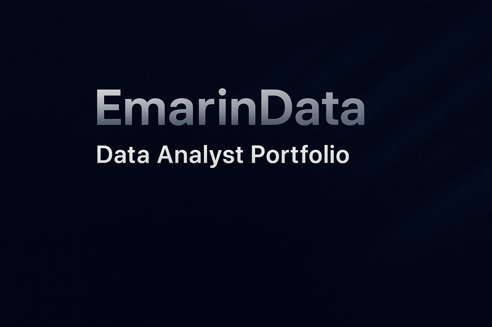

# 📊 EmarinData Portfolio

¡Bienvenido a mi portafolio de proyectos como **Analista de Datos**!  
Aquí muestro mis avances, prácticas y proyectos reales utilizando **Excel**, **Power BI**, **SQL** y **Python**.

---

## 🎯 Sobre mí

Soy **Emilio Jesús Marín Marín**, analista de datos en formación.  
Mi objetivo es **transformar datos en información útil** para la toma de decisiones, combinando análisis técnico y una visión práctica del negocio.

Actualmente estoy formándome en:
- 📈 **Power BI** (Certificación PL-300 en curso)  
- 💡 **Excel avanzado**  
- 🧩 **SQL para análisis de datos**  
- 🤖 **Python con enfoque en Inteligencia Artificial**

---

## 🗂️ Estructura del repositorio

- **Excel_Projects** → Análisis y dashboards creados con Excel.  
- **PowerBI_Projects** → Informes interactivos con Power BI.  
- **SQL_Projects** → Consultas y ejercicios de análisis con SQL.  
- *(Próximamente: proyectos combinando Python y Machine Learning.)*

---

## 🌐 Conecta conmigo

- [💼 LinkedIn](https://www.linkedin.com/in/emarin-data)  
- [✉️ Email](mailto:emiliojm1995@gmail.com)  
- [📂 GitHub](https://github.com/EmarinData)

---
