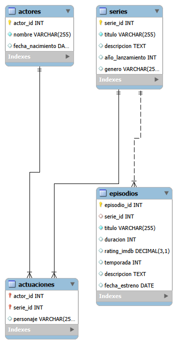

# 🎬 Análisis Estratégico: Catálogo de Netflix (SQL)

## 📋 Descripción del Proyecto
Este proyecto consiste en un análisis técnico y estadístico de una base de datos relacional que simula el ecosistema de contenidos de Netflix. A través de consultas SQL avanzadas, se extraen métricas clave sobre valoraciones, duración de episodios y recurrencia de talento para optimizar la toma de decisiones sobre el contenido.

---

## 🛠️ Stack Tecnológico
* **Motor de Base de Datos:** MySQL.
* **Lenguaje:** SQL (Data Query Language).
* **Herramientas:** MySQL Workbench.

---

## 📊 Preguntas de Negocio Resueltas
El análisis aborda los siguientes pilares estratégicos:

### 1. Métricas de Calidad (Ratings)
* Identificación de los episodios mejor valorados y cálculo de la nota media por serie y género utilizando funciones de agregación (`AVG`) y limpieza de datos (`ROUND`).

### 2. Análisis de Talento
* Detección de actores con participación en múltiples producciones mediante el uso de **subconsultas** y **filtrado avanzado** (`HAVING`).

### 3. Gestión de Catálogo
* Clasificación dinámica de series según su volumen de episodios y análisis de la duración media para entender el compromiso de tiempo del usuario.

### 4. Reporting de Operaciones
* Uso de `JOINs` múltiples para reconstruir la relación entre series, episodios, actores y personajes.

---

## 🏗️ Modelo de Datos (Diagrama ER)
  
*Nota: El modelo se basa en 4 tablas principales: **Series, Episodios, Actores y Actuaciones** (tabla relacional muchos a muchos).*

---

## 🚀 Contenido del Repositorio
* 📄 `analisis_netflix.sql`: Script principal con las 10 consultas analíticas.
* 📄 `setup_db.sql`: Script de creación y carga de datos (Esquema original de Udemy).
* 🖼️ `diagrama_netflix.png`: Visualización de la arquitectura de la base de datos.

---

## 💡 Conclusiones Destacadas
* Se identificaron los géneros con mayor rating promedio, permitiendo priorizar inversiones en categorías de alto engagement.
* El uso de lógica condicional permitió segmentar el catálogo en diferentes formatos (Miniseries vs. Series de larga duración).
